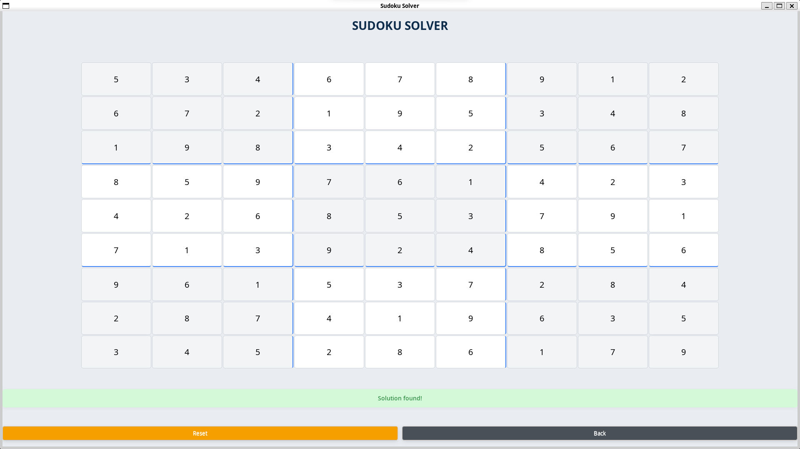
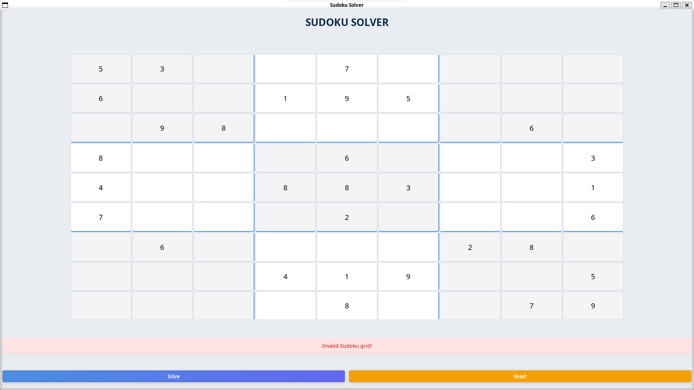

---

# Grid Guru: A Sudoku Solver with GTK GUI  
**Grid Guru** is a feature-complete Sudoku puzzle solver implemented in C with a GTK-based graphical interface. Designed for both enthusiasts and developers, it combines algorithmic problem-solving with intuitive user interaction. This project emphasizes code clarity, efficient backtracking, and robust error handling while demonstrating practical GUI development in C.

---

## Table of Contents  
1. [Project Overview](#project-overview)  
2. [Key Features](#key-features)  
3. [Installation](#installation)  
4. [File Structure & Implementation](#file-structure--implementation)  
5. [Design Choices & Rationale](#design-choices--rationale)  
6. [Usage Guide](#usage-guide)  
7. [Screenshots](#screenshots)  
8. [Future Improvements](#future-improvements)  
9. [Acknowledgments](#acknowledgments)  
10. [License](#license)  

---

## Project Overview  
Grid Guru solves Sudoku puzzles using a backtracking algorithm, rendered through a GTK 3 GUI. Users can input puzzles, validate their correctness, solve them, and reset or revert changes. The project serves as a case study in:  
- **Algorithm Design**: Efficient backtracking for constraint satisfaction problems.  
- **GUI Development**: GTK widget management, event handling, and state synchronization.  
- **Software Engineering**: Modular code structure, error handling, and build automation.  

---

## Key Features  
- **Interactive GTK Interface**:  
  - Input cells with validation (digits 1–9 or empty).  
  - Visual feedback for invalid configurations.  
- **Backtracking Solver**: Recursive algorithm to find valid solutions.  
- **State Management**:  
  - **Solve**: Computes and displays the solution.  
  - **Reset**: Clears the grid to zeros.  
  - **Back**: Reverts to the user’s original input post-solution.  
- **Input Sanitization**: Rejects non-digit characters and out-of-range values.  

---

## Installation  
### Dependencies  
- **GTK 3**: GUI framework.  
- **GCC**: C compiler.  
- **Make**: Build automation.  

### Steps  
```bash
# Debian/Ubuntu
sudo apt install build-essential libgtk-3-dev

# macOS (Homebrew)
brew install gtk+3

# Clone & Build
git clone https://github.com/Shoaib-Programmer/GridGuru.git
cd GridGuru
make        # Compile
bin/sudoku_solver # Run
```

---

## File Structure & Implementation  
### `src/main.c`  
- **Purpose**: GTK GUI setup and event handling.  
- **Key Components**:  
  - `create_main_window()`: Initializes the 9x9 grid of `GtkEntry` widgets with stylistic subgrid separators.  
  - `on_solve_button_clicked()`: Validates the puzzle, triggers the solver, and updates the UI.  
  - **State Management**: Toggles button visibility (Solve/Back) and syncs the grid with `initial_grid`.  

### `src/sudoku.c`  
- **Purpose**: Core Sudoku logic.  
- **Functions**:  
  - `isValid()`: Checks row, column, and 3x3 subgrid constraints.  
  - `solveSudoku()`: Recursive backtracking implementation.  
- **Algorithm**: Prioritizes empty cells dynamically (no fixed order) for efficiency.  

### `src/sudoku.h`  
- Header file declaring function prototypes (`isValid`, `solveSudoku`) and constants (`SIZE=9`).  

### `Makefile`  
- **Build Automation**: Compiles `main.c` and `sudoku.c` into `grid_guru`.  
- **Targets**:  
  - `all`: Default build.  
  - `clean`: Remove binaries.  
  - `run`: Compile and execute.  

### `resources/`  
- Directory for screenshots demonstrating UI states:  
  - `initial-state.png`: Default puzzle.  
  - `solved-state.png`: Post-solution.  
  - `invalid-state.png`: Error feedback.  
  - `nosolution-state.png`: No solution exists.

---

## Design Choices & Rationale  
### 1. **GTK for GUI**  
- **Why GTK?**  
  - **Native Performance**: Lightweight compared to Electron or web-based tools.  
  - **C Compatibility**: Direct integration without language bindings.  
- **Tradeoff**: Steeper learning curve vs. simplicity of terminal-only solvers.  

### 2. **Backtracking Algorithm**  
- **Choice**: Classic recursive backtracking.  
- **Rationale**:  
  - **Simplicity**: Easy to implement and debug for a 9x9 grid.  
  - **Adequate Performance**: Solves most puzzles in <1ms.  
- **Limitation**: Not optimized for "hard" Sudokus with sparse initial clues.  

### 3. **Grid State Management**  
- **`initial_grid` Array**: Stores the user’s initial input to enable the "Back" functionality.  
- **Why Global State?** Simplifies callback handling in GTK without passing structs.  

### 4. **Input Validation**  
- **Sanitization**: In `get_grid_from_entries()`, invalid characters are coerced to `0`.  
- **Pre-Solve Check**: `isValid()` ensures no duplicates before invoking the solver.  

---

## Usage Guide  
1. **Launch**: Run `./grid_guru` to load the default puzzle.  
2. **Input**: Click cells and type numbers (1–9). Leave empty for unknowns.  
3. **Solve**: Click "Solve" to compute the solution (if valid).  
4. **Reset**: "Reset" clears all cells.  
5. **Back**: After solving, "Back" restores your original input.  

---

## Screenshots  
| Initial Puzzle | Solved State | Invalid Input | No Solution |  
|----------------|--------------|---------------|-------------|  
|  |  |  |  |  

---

<!-- ## Future Improvements  
1. **Optimized Solvers**: Implement Dancing Links (Algorithm X) for harder puzzles.  
2. **Puzzle Generator**: Create random valid Sudokus of varying difficulty.  
3. **Undo/Redo**: Enhance user experience with action history.  

--- -->

## Acknowledgments  
- **GTK Team**: For maintaining the GUI framework.  
- **Classic Sudoku Literature**: Inspired the backtracking approach.  

---

## License  
MIT License. See [LICENSE](LICENSE) for details.

--- 
